

  

 

  

This repository contains the design, simulation, and physical hardware implementation of a Programmable Gain Amplifier constructed entirely using discrete Bipolar Junction Transistors (BJTs).

**Important Note on Application:**
This amplifier is purely built for **low-frequency message signal applications**. It is strictly not intended for use with high-frequency carrier signals.

**Key Specifications:**
*   **Operating Input Voltage Range:** 1 mV to 1.2 V
*   **Amplification Factor:** Up to 8x amplification
*   **Gain Control:** 3-bit programmable digital control (8 discrete gain steps)

 

  

The amplification factor is controlled digitally using a 3-bit binary input system, yielding 8 distinct gain levels (Step 0 through Step 7). 

*   **Binary Inputs:** The system takes three digital inputs: **B2** (Most Significant Bit), **B1**, and **B0** (Least Significant Bit).
*   **Switching Mechanism:** These digital signals are applied to the bases of three switching transistors in the input network. 
*   **Impedance Modulation:** When a control bit is driven to logic HIGH, its corresponding transistor turns on, acting as a switch that connects a specific parallel resistor to ground. This alters the equivalent AC impedance of the feedback network connected to the differential amplifier.
*   **Gain Adjustment:** As the binary input value increments (from `000` up to `111`), the equivalent resistance to ground decreases. This decrease in resistance proportionately increases the closed-loop voltage gain of the amplifier, allowing precise scaling up to the maximum 8x amplification.

 

  

The core circuit is based on a discrete operational amplifier topology, utilizing a differential input pair, a current mirror active load, a voltage amplifier stage, and an output buffer.

  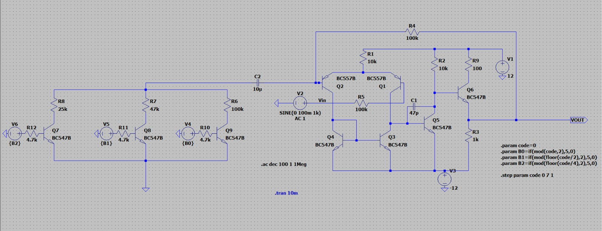

 

  

The circuit has been simulated using SPICE to verify the transient response, signal integrity, and stability across all programmable gain states for low-frequency message signals.

  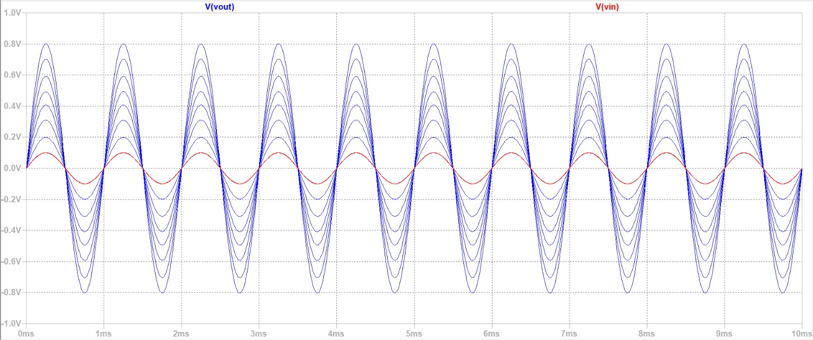

 

  

The physical hardware has been constructed and tested on a breadboard. The following images demonstrate the physical setup and the oscilloscope outputs validating the 8 distinct gain steps.

### Breadboard Setup

  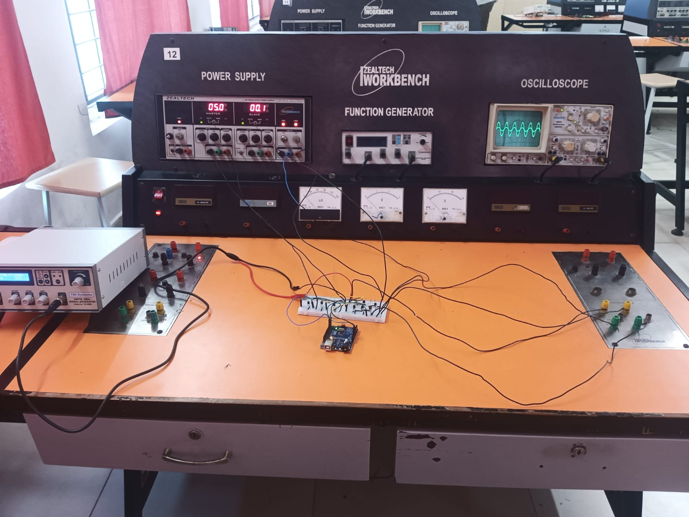
  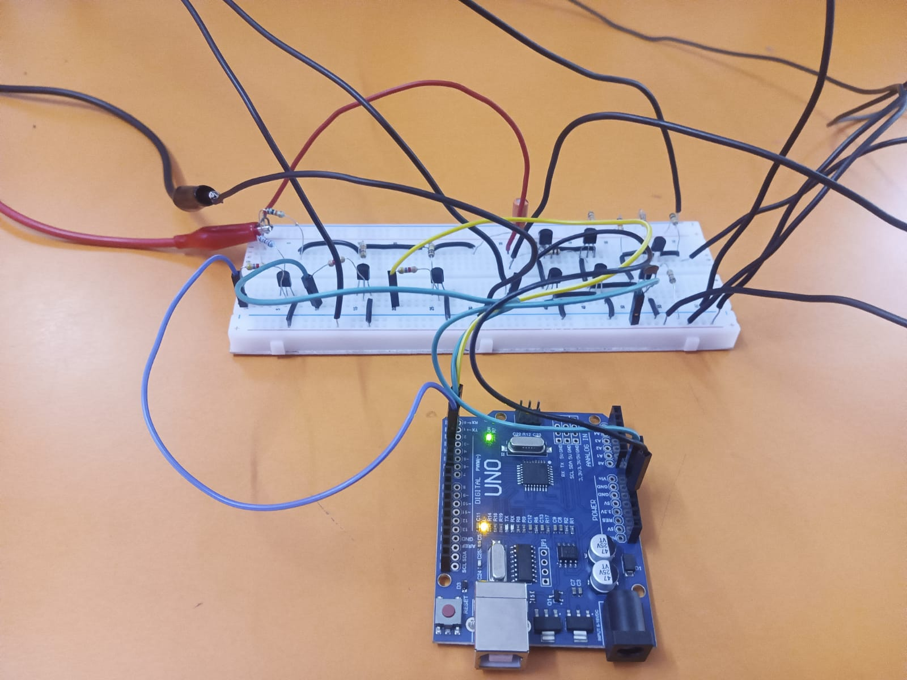
  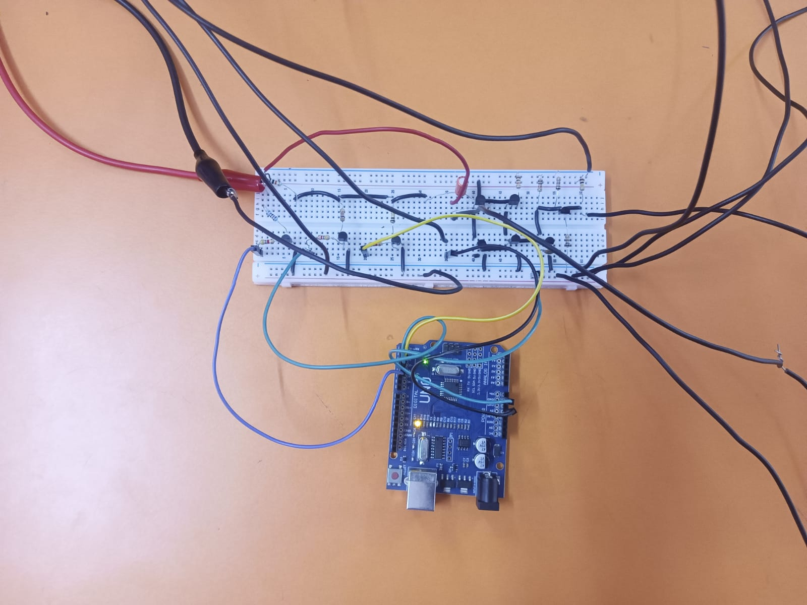

### Gain Steps Validation

#### Step 0 (Binary: 000)

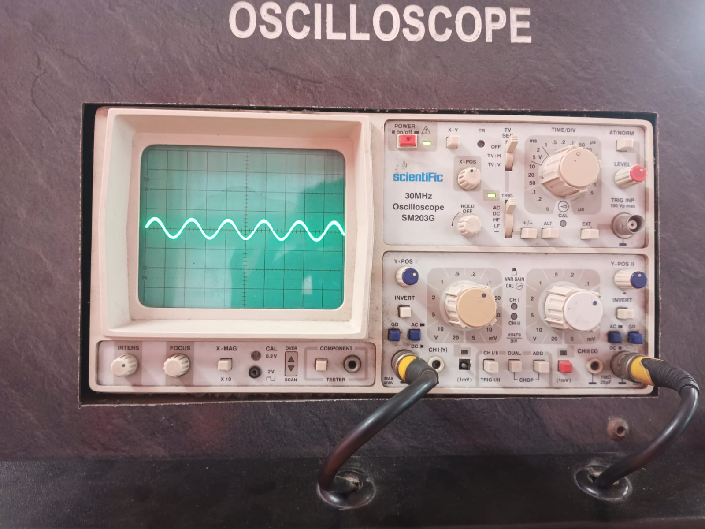

#### Step 1 (Binary: 001)

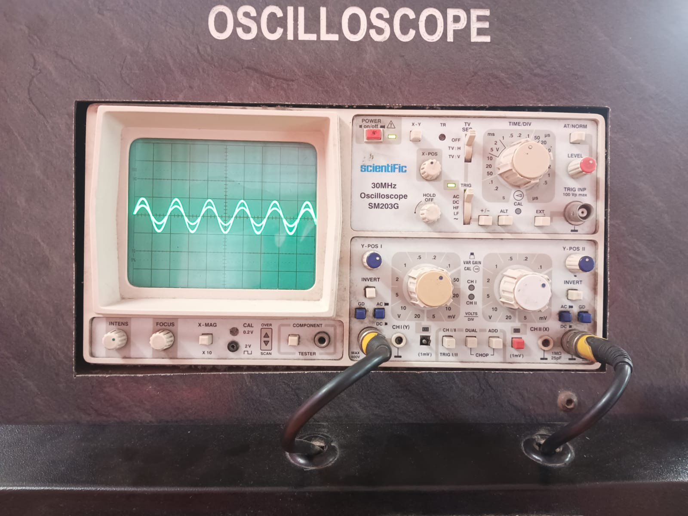

#### Step 2 (Binary: 010)

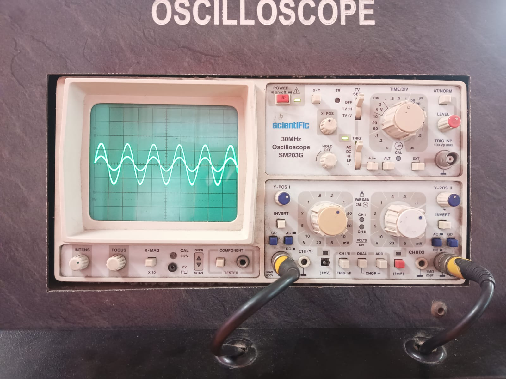

#### Step 3 (Binary: 011)

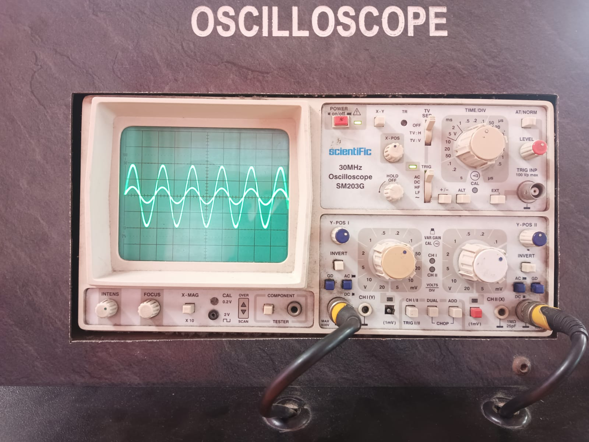

#### Step 4 (Binary: 100)

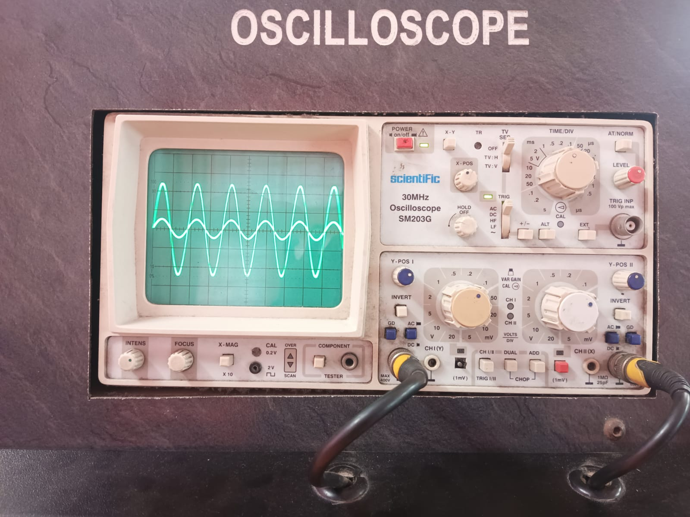

#### Step 5 (Binary: 101)

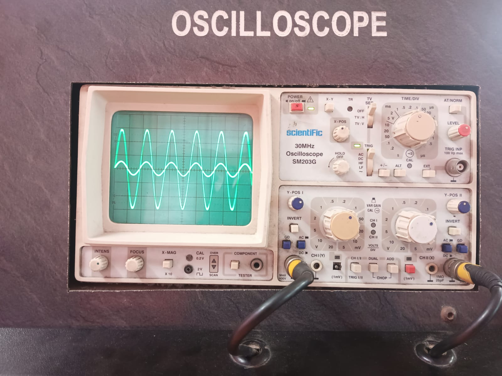

#### Step 6 (Binary: 110)

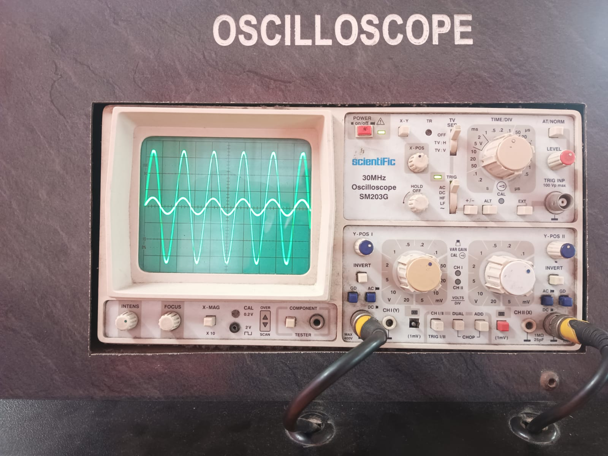

#### Step 7 (Binary: 111)

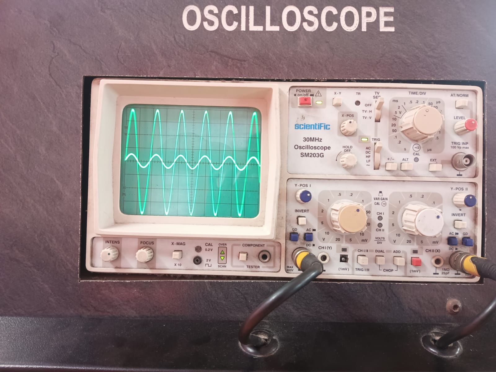

